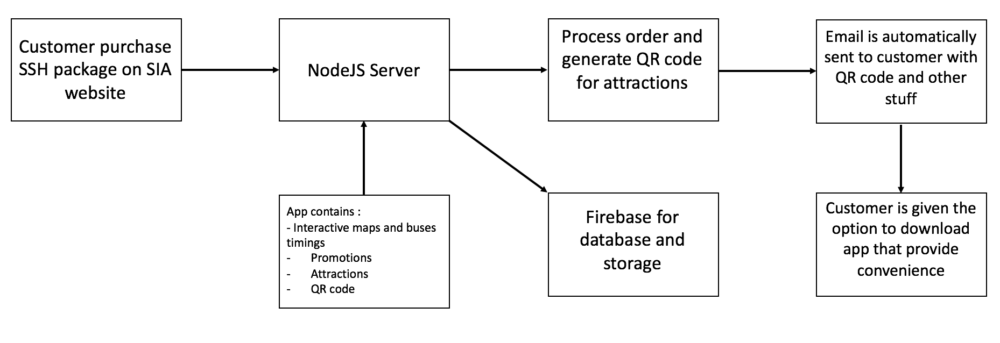
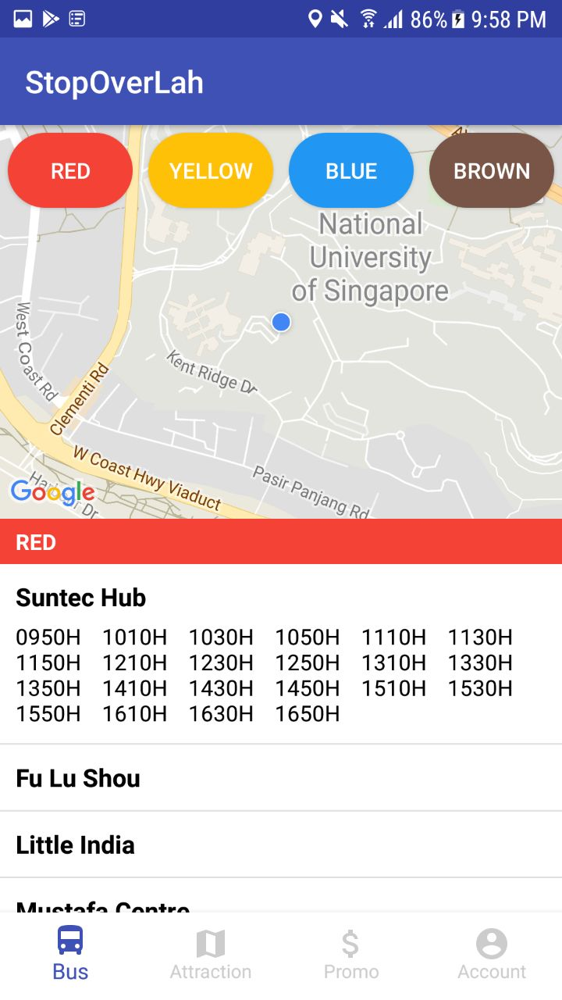
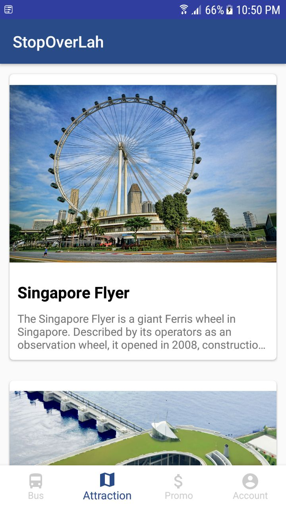
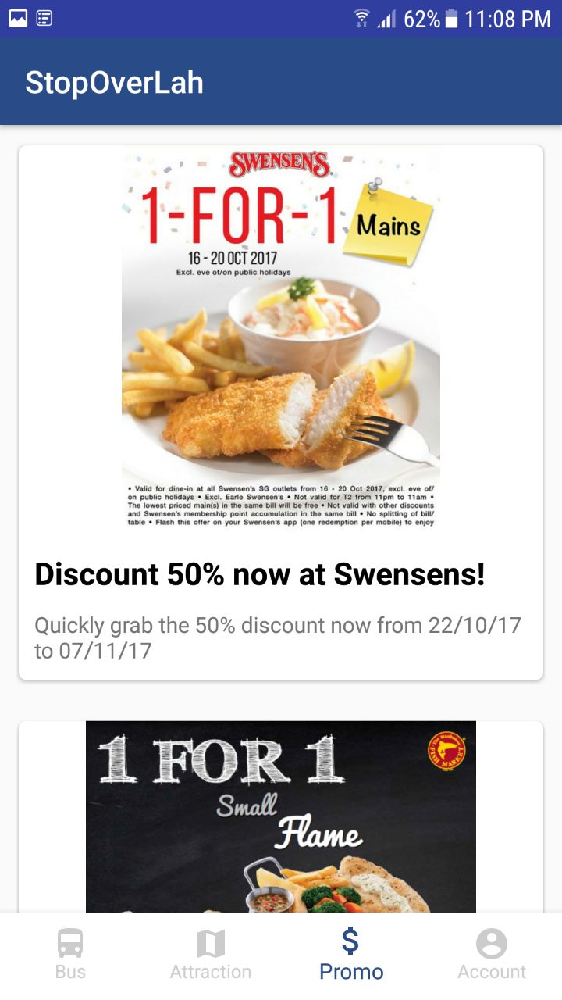
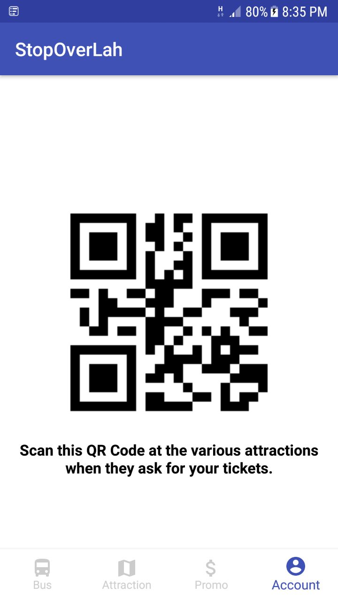
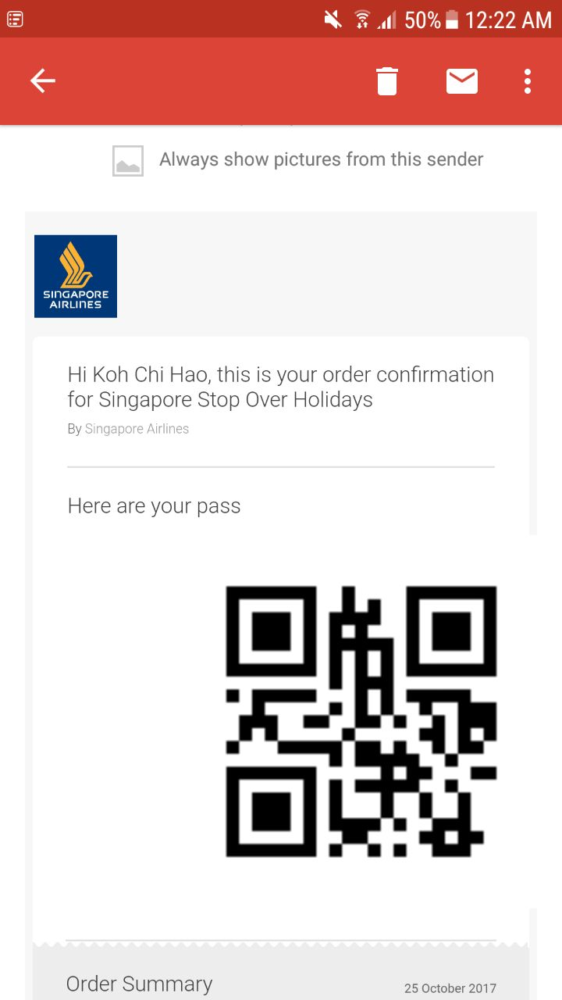

# SIA APP CHALLENGE 2017 

#### Team Name : 
Bazingaa

#### Business Challenge :
The Singapore Stopover Holiday (SSH) currently requires passengers to collect a pack of vouchers and brochures on arrival. It is also a challenge to keep them updated on changes in opening times and special events at the various tourist attractions.

#### Fucntionalities : 
- Email of entire SSH package will be automatically and dynamically sent to customer's email.
- QR code that ties to customer's particulars will be automatically sent to customer's email
- StopoverLah Mobile App
	- Prompt user to download app when email is sent 
	- An app includes everything in the SSH welcome pack. 
		- Interactive Maps (Bus timings) 
		- QR Code for scanning at attractions 
		- Exclusive deals
		- More informations on attractions. 
- SIA staff can use a web portal to edit information on attractions.

#### How it works?

#### Technology used
- Android (App)
- NodeJS (Backend)
- Firebase (Database and Storage)

#### Number of man hours to used to complete this
- Close to 50hrs

#### What IDE we used? 
- Android Studio 
- Sublime Text

#### Done by NUS Computing students
- Koh Chi Hao, Computer Science Y1 [GitHub](https://github.com/kohchihao)
- Tan Jin Ying, Computer Science Y1 [Github](https://github.com/jinyingtan)
- Edward Wang, Information System Y2 [Github](https://github.com/wardzxzxc)
 
#### Screenshots of the app and email

